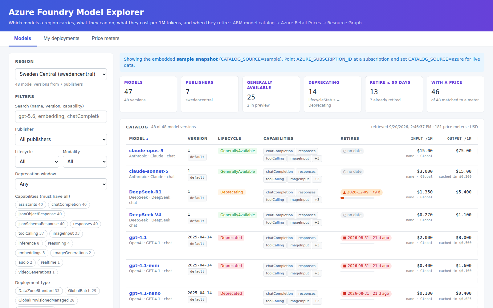

# Foundry Model Ledger

A small console for the question every team asks before they pick a model: **what does this region actually carry, what can each model do, what does it cost per million tokens, and when does it retire?** And the question every platform team asks afterwards: **which of our own deployments are affected?**

If you only need region availability, Microsoft's [Foundry Model Explorer](https://foundry-models.azurewebsites.net/explorer) already shows every model with the regions that carry it, from a periodic snapshot. The Ledger reads your subscription live and adds the two things that tool does not have: list prices per 1M tokens in your currency, matched from the Azure Retail Prices API, and a join to your own deployments sorted by retirement date. Its detail panel also fans out to every region to show where else a model is available.

> The C# project and namespace are still called `FoundryModelExplorer`; only the product name changed.

The answers exist in Azure, but in three places that were never designed to be read together:

| Question | Source | How the explorer reads it |
|---|---|---|
| Which models and versions exist in a region, with capabilities, lifecycle status, SKUs and retirement dates | ARM: `Microsoft.CognitiveServices/locations/{region}/models` | `GET …/models?api-version=2024-10-01`, paged, with the caller's identity |
| What they cost | [Azure Retail Prices API](https://learn.microsoft.com/rest/api/cost-management/retail-prices/azure-retail-prices), `serviceName eq 'Foundry Models'` | Public, no auth, paged; meters are matched to catalog models by a tokenising matcher (see below) |
| Which of *my* deployments run on a retiring version | ARM: the subscription's `Microsoft.CognitiveServices/accounts` and each account's `/deployments` | Listed per account (Resource Graph does not index deployments), joined to the catalog of each deployment's region |



## What you get

**Models tab.** Region picker (every physical Azure region, with a marker on those without AI services), a price-currency switch (any ISO 4217 code the Retail Prices API knows: USD, EUR, GBP, SEK, …), stat tiles, and a sortable table: model, version (default version flagged), lifecycle status, capability chips, retirement date with a days-left bar, input/output price per 1M tokens with a confidence label, and deployment types. Filters on publisher, lifecycle, modality, retirement window, required capabilities and deployment type. CSV export of the filtered view.

**Detail panel.** Click a row: every capability ARM reports (context window, max output tokens, tool calling, …), every SKU with min/default/max capacity, every retail meter that was matched to the model with its direction, deployment type, tier and normalised per-1M price, a **Check all regions** button that lists every Azure region carrying that model/version (one lightweight catalog call per region, cached), and the raw JSON.

**My deployments tab.** All model deployments in every Cognitive Services / Foundry account of the subscription, joined to their region's catalog, sorted by soonest retirement, with the `versionUpgradeOption` so you can see whether Azure will auto-upgrade them.

**Price meters tab.** The raw Retail Prices rows for the region, searchable, so you can check the matcher's evidence.

## Why prices need a matcher

The Retail Prices API is written for invoices. A single model, `gpt-5.6-sol`, is spread over meters such as `5.6 sol ShortCo Inp Std Gl 1M Tokens`, `5.6 sol LongCo Cd Wr PP Gl 1M Tokens` and `56sol ShCo Cd Wr Fl Gl 1M Tokens`; `grok-4.6` appears as `4.6 Inp DZ Tokens` under product `Azure Grok Models`; older meters are per 1K tokens and newer ones per 1M. There is no model-id field.

`Services/PriceMatcher.cs` therefore:

1. narrows meters to the model's publisher family via `productName`;
2. tokenises both sides the same way and requires every model token (minus the family prefix such as `gpt` or `grok`) to appear in the meter, in order, with no *other* variant token (`mini`, `nano`, `pro`, `chat`, `codex`, `sol`, …) present;
3. pins the version when the meter carries a `MMDD` or `MMDDYYYY` token (`o3 0416`, `chat-latest 08062026`);
4. classifies each meter: direction (`Inp`/`Outp`/`Cd`/`Wr`), deployment type (`Gl`/`DZ`/`regnl`), tier (`Std`/`PP`/`Batch`/`Fl`), context (`ShortCo`/`LongCo`);
5. normalises `1K`, `1M` and per-token units to a price per 1M tokens;
6. picks a headline (Global Standard, short context, uncached) and reports a confidence: **exact** (date matched), **name** (name only), **loose** (first tokens of a long catalog name such as `Llama-4-Maverick-17B-128E-Instruct-FP8`), or **none**.

Every matched meter is shown in the detail panel, so the headline number is never the only evidence. Treat the prices as list prices to sanity-check a design, not as a quote.

## Project layout

```
azure.yaml                         azd service definition (one Function App)
infra/                             Bicep: Flex Consumption Function App, storage, App Insights,
                                   user-assigned identity, Reader on the subscription
src/FoundryModelExplorer/          .NET 8 isolated Azure Functions
  Functions/ApiFunctions.cs        GET api/regions, api/models, api/models/{name}/{version},
                                   api/availability, api/meters, api/deployments, api/health
  Functions/UiFunctions.cs         serves wwwroot/index.html at the root (routePrefix is "")
  Services/ArmGateway.cs           bearer token + paged GET/POST against management.azure.com
  Services/CatalogService.cs       catalog read + enrichment (deprecation level, prices, modality)
  Services/PriceMatcher.cs         the meter matcher described above
  Services/PricingService.cs       Retail Prices client with per-region cache
  Services/DeploymentService.cs    accounts + deployments via ARM, catalog join
  Services/RegionService.cs        regions that host Cognitive Services accounts
  wwwroot/index.html               the UI (single file, no build step)
samples/sample-catalog.json        offline snapshot used when CATALOG_SOURCE=sample
scripts/run-local.ps1              local run (Windows PowerShell 5.1 compatible)
scripts/export-snapshot.ps1        export a real snapshot of a region to samples/
scripts/make-sample.py             regenerates the illustrative sample (fictional prices and dates)
tools/mock-server.mjs              runs the UI on Node against the sample, no .NET needed
```

## Run it

### Prerequisites

- .NET 8 SDK, Azure Functions Core Tools v4, Azure CLI (`az login`)
- The signed-in identity needs **Reader** on the subscription (the catalog endpoint, the provider manifest, the account list and the deployment lists all honour RBAC)
- For `azd up`: Azure Developer CLI

### Locally against Azure

```powershell
az login
.\scripts\run-local.ps1 -Region swedencentral
# open http://localhost:7071/
```

The script writes `local.settings.json` from the template with your current subscription id. `DefaultAzureCredential` picks up the `az login` session.

### Locally without Azure

```powershell
.\scripts\run-local.ps1 -Sample          # Function host, embedded snapshot
node tools\mock-server.mjs               # or: no .NET at all, same UI on http://localhost:7071/
```

The shipped `samples/sample-catalog.json` is illustrative (generated by `scripts/make-sample.py`; the prices and retirement dates are made up to exercise every code path). Replace it with a real export:

```powershell
.\scripts\export-snapshot.ps1 -Region swedencentral -Currency EUR
```

### Deploy

```powershell
azd auth login
azd env new foundry-explorer
azd env set DEFAULT_REGION swedencentral
azd env set PRICE_CURRENCY EUR            # optional, default USD
azd up
```

`azd up` creates a Flex Consumption Function App with a user-assigned managed identity and assigns that identity **Reader on the subscription** (`infra/main.bicep`). You need Owner or User Access Administrator on the subscription for that role assignment. The URL is printed as `SERVICE_API_ENDPOINT`.

The Function App has no authentication of its own. Put Easy Auth (Entra ID) in front of it before sharing the URL, or keep it internal; the data it shows is your subscription's catalog and deployment list.

### Clearing the cache

The catalog (60 min), meters (6 h) and region list (24 h) are cached in memory per instance. The **Refresh data** button on the Models tab calls `POST /api/cache/clear` and reloads; from a shell, `curl -X POST https://<app>.azurewebsites.net/api/cache/clear` does the same. A Function App restart (`az functionapp restart`) clears everything on every instance.

## Settings

| Setting | Default | Meaning |
|---|---|---|
| `AZURE_SUBSCRIPTION_ID` | — | Subscription whose catalog and deployments to read |
| `DEFAULT_REGION` | `swedencentral` | Region the UI opens on |
| `PRICE_CURRENCY` | `USD` | Default currency; the UI's currency switch overrides it per request (`?currency=EUR`) |
| `CATALOG_SOURCE` | `azure` | `azure` (live) or `sample` (embedded snapshot) |
| `CATALOG_CACHE_MINUTES` | `60` | In-memory cache for the catalog per region |
| `PRICES_CACHE_MINUTES` | `360` | In-memory cache for the meters per region |
| `AZURE_CLIENT_ID` | set by Bicep | Client id of the user-assigned identity, so `DefaultAzureCredential` picks it |

## Things worth knowing

- `lifecycleStatus` values seen in the wild: `GenerallyAvailable`, `Preview`, `Deprecating`, `Deprecated`, and the older `Stable`. The explorer treats `Stable` as GA.
- A model can still be listed by the catalog endpoint after it is closed to new deployments (gpt-4o-mini is the classic case). The list is "what the region knows about", not "what you can deploy today"; the SKU list and `deprecation.inference` are the better signals.
- The retirement level is computed from `deprecation.inference`: **ok** (> 1 year), **warning** (< 1 year), **serious** (< 90 days), **retired** (past), **no date** when Azure has not published one.
- Retail Prices returns up to 1000 rows per page; a region has a few hundred `Foundry Models` meters, so this is usually one or two pages. The API is public and rate-limited; the explorer caches per region.
- Provisioned throughput (PTU) meters are hourly per unit and not per model; they are shown on the Price meters tab but not attached to models.

## Build notes

The project targets .NET 8 isolated with `Microsoft.Azure.Functions.Worker` 2.x and the ASP.NET Core HTTP integration. First `dotnet build` on a fresh machine restores from nuget.org; if a package version in the `.csproj` has been superseded, take the nearest current version of the same package.
